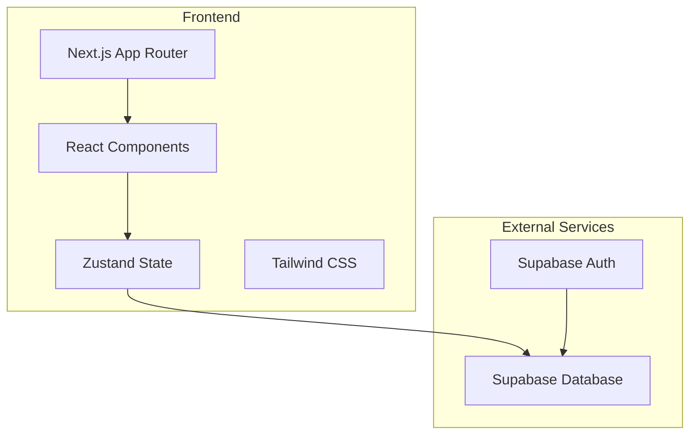
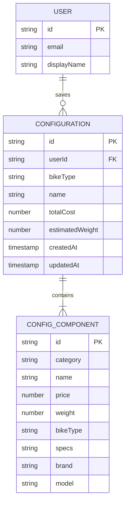

# Architecture Design

> **路径**: `/workspace/.trae/documents/arch.md`
> **版本**: v4.0.0
> **更新日期**: 2026-07-06



## 2. Technology Description

- **Frontend**: Next.js 14 (App Router) + React 18 + TypeScript 5 + Tailwind CSS 3
- **Initialization Tool**: `create-next-app`
- **State Management**: Zustand (模块化 stores)
- **Auth & Database**: Supabase (Auth + Database)
- **Animations**: Framer Motion
- **Icons**: Lucide React

## 3. Route Definitions

| Route    | Purpose                      |
| -------- | ---------------------------- |
| /        | Home/Configurator main page  |
| /about   | About page                   |
| /faq     | FAQ page                     |
| /library | Saved configurations library |
| /login   | Login/Signup page            |

## 4. Data Model

### 4.1 Data Model Definition



### 4.2 Type Definitions

```typescript
// src/types/index.ts
export type BikeType = 'Road' | 'MTB' | 'Fold';
export type ComponentCategory =
  'Frame' | 'Drivetrain' | 'Wheelset' | 'Suspension' | 'Cockpit' | 'Tires';

export interface ConfigComponent {
  id: string;
  category: ComponentCategory;
  name: string;
  price: number;
  weight: number;
  bikeType?: BikeType;
  specs?: string;
  brand?: string;
  model?: string;
}

export interface Configuration {
  id?: string;
  userId?: string;
  bikeType: BikeType;
  name: string;
  components: ConfigComponent[];
  totalCost: number;
  estimatedWeight: number;
  createdAt?: Date;
  updatedAt?: Date;
}

export interface ConfigState {
  activeType: BikeType;
  components: ConfigComponent[];
  configId: string | null;
  manualConfigName: string | null;
  allDbComponents: ConfigComponent[];
  showLibrary: boolean;
  myConfigs: Configuration[];
  isLoggedIn: boolean;
  isSaving: boolean;
  showComponentSelector: boolean;
  editingComponentId: string;
}
```

## 5. Project Structure

```
/workspace
├── src/
│   ├── app/
│   │   ├── layout.tsx          # Root layout
│   │   ├── page.tsx            # Home/Configurator
│   │   ├── about/
│   │   │   └── page.tsx        # About page
│   │   ├── faq/
│   │   │   └── page.tsx        # FAQ page
│   │   ├── library/
│   │   │   └── page.tsx        # Saved configs
│   │   ├── login/
│   │   │   └── page.tsx        # Login/Signup
│   │   └── globals.css
│   ├── components/
│   │   ├── configurator/
│   │   │   ├── BikeTypeSelector.tsx
│   │   │   ├── BuildList.tsx
│   │   │   ├── ComponentSelector.tsx
│   │   │   ├── ComponentDetailModal.tsx
│   │   │   ├── ComparePanel.tsx
│   │   │   ├── CostBreakdownChart.tsx
│   │   │   ├── RecommendedConfigs.tsx
│   │   │   ├── ShareModal.tsx
│   │   │   └── SummaryPanel.tsx
│   │   ├── layout/
│   │   │   ├── Navbar.tsx
│   │   │   └── Footer.tsx
│   │   ├── sections/
│   │   │   ├── Hero.tsx
│   │   │   ├── Features.tsx
│   │   │   ├── Pricing.tsx
│   │   │   └── Cta.tsx
│   │   └── ui/
│   │       ├── Button.tsx
│   │       ├── Card.tsx
│   │       ├── Modal.tsx
│   │       ├── ErrorBoundary.tsx
│   │       ├── LoadingScreen.tsx
│   │       ├── Skeleton.tsx
│   │       ├── ThemeToggle.tsx
│   │       ├── OnboardingGuide.tsx
│   │       ├── SupportModal.tsx
│   │       └── ...shadcn components
│   ├── lib/
│   │   ├── stores/            # Zustand stores (模块化)
│   │   │   ├── config-store.ts
│   │   │   ├── config-ui-store.ts
│   │   │   ├── compare-store.ts
│   │   │   └── user-store.ts
│   │   ├── i18n/              # 国际化
│   │   │   ├── index.ts
│   │   │   ├── en.ts
│   │   │   └── zh-CN.ts
│   │   ├── data/              # 模块化数据
│   │   │   ├── index.ts
│   │   │   ├── component-details.ts
│   │   │   ├── component-alternatives.ts
│   │   │   └── details/
│   │   ├── supabase.ts        # Supabase client
│   │   ├── supabase-service.ts # Supabase service
│   │   ├── constants.ts       # App constants
│   │   ├── recommended-configs.ts
│   │   ├── utils.ts
│   │   └── toast.ts
│   ├── hooks/
│   │   ├── useBikeConfig.ts
│   │   └── useSupabaseAuth.ts
│   └── types/
│       └── index.ts
├── public/                     # Static assets
├── supabase/
│   └── migrations/             # Supabase migrations
├── next.config.mjs
├── tailwind.config.ts
├── tsconfig.json
├── vitest.config.ts
└── package.json
```

## 6. Migration Checklist

- ✅ Remove Angular-specific files (angular.json, src/app/*.ts, etc.)
- ✅ Set up Next.js project structure
- ✅ Migrate TypeScript types
- ✅ Port constants and default component data
- ✅ Set up Supabase in Next.js
- ✅ Build UI components
- ✅ Implement state management with Zustand (模块化 stores)
- ✅ Add animation effects with Framer Motion
- ✅ Update deployment configs (EdgeOne/Vercel)
- ✅ Test and verify build
- ✅ Add About/FAQ/Login pages
- ✅ Add sections components (Hero/Features/Pricing/Cta)
- ✅ Implement i18n system with type safety
- ✅ Add Supabase migrations
