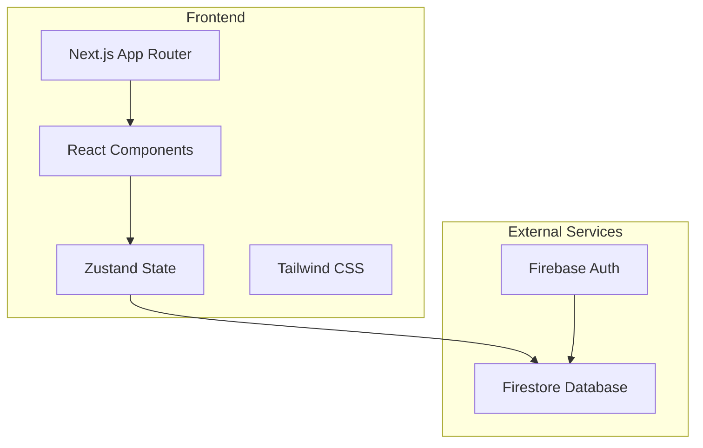
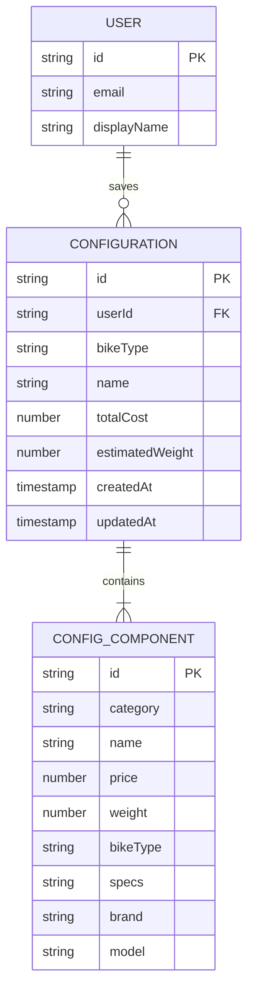

## 1. Architecture Design



## 2. Technology Description
- **Frontend**: Next.js 15 (App Router) + React 19 + TypeScript 5 + Tailwind CSS 4
- **Initialization Tool**: `create-next-app`
- **State Management**: Zustand (lightweight, signal-friendly)
- **Auth & Database**: Firebase (Auth + Firestore)
- **Animations**: Framer Motion
- **Icons**: Lucide React

## 3. Route Definitions
| Route | Purpose |
|-------|---------|
| / | Home/Configurator main page |
| /configurator | Bike configuration workspace |
| /library | Saved configurations library |

## 4. Data Model

### 4.1 Data Model Definition



### 4.2 Type Definitions

```typescript
// src/types/index.ts
export type BikeType = 'Road' | 'MTB' | 'Fold';
export type ComponentCategory = 'Frame' | 'Drivetrain' | 'Wheelset' | 'Suspension' | 'Cockpit' | 'Tires';

export interface ConfigComponent {
  id: string;
  category: ComponentCategory;
  name: string;
  price: number;
  weight: number;
  bikeType?: BikeType;
  specs?: string;
  brand?: string;
  model?: string;
}

export interface Configuration {
  id?: string;
  userId?: string;
  bikeType: BikeType;
  name: string;
  components: ConfigComponent[];
  totalCost: number;
  estimatedWeight: number;
  createdAt?: Date;
  updatedAt?: Date;
}

export interface ConfigState {
  activeType: BikeType;
  components: ConfigComponent[];
  configId: string | null;
  manualConfigName: string | null;
  allDbComponents: ConfigComponent[];
  showLibrary: boolean;
  myConfigs: Configuration[];
  isLoggedIn: boolean;
  isSaving: boolean;
  showComponentSelector: boolean;
  editingComponentId: string;
}
```

## 5. Project Structure

```
/workspace
├── src/
│   ├── app/
│   │   ├── layout.tsx          # Root layout
│   │   ├── page.tsx            # Home/Configurator
│   │   ├── library/
│   │   │   └── page.tsx        # Saved configs
│   │   └── globals.css
│   ├── components/
│   │   ├── configurator/
│   │   │   ├── BikeTypeSelector.tsx
│   │   │   ├── BuildList.tsx
│   │   │   ├── ComponentSelector.tsx
│   │   │   └── SummaryPanel.tsx
│   │   ├── layout/
│   │   │   ├── Navbar.tsx
│   │   │   └── Sidebar.tsx
│   │   └── ui/
│   │       ├── Button.tsx
│   │       ├── Card.tsx
│   │       └── Modal.tsx
│   ├── lib/
│   │   ├── store.ts            # Zustand store
│   │   ├── firebase.ts         # Firebase client
│   │   ├── constants.ts        # App constants
│   │   └── utils.ts
│   ├── hooks/
│   │   ├── useBikeConfig.ts
│   │   └── useFirebaseAuth.ts
│   └── types/
│       └── index.ts
├── public/                     # Static assets (unchanged)
├── next.config.js
├── tailwind.config.ts
└── package.json
```

## 6. Migration Checklist

- ✅ Remove Angular-specific files (angular.json, src/app/*.ts, etc.)
- ✅ Set up Next.js project structure
- ✅ Migrate TypeScript types
- ✅ Port constants and default component data
- ✅ Set up Firebase in Next.js
- ✅ Build UI components
- ✅ Implement state management with Zustand
- ✅ Add animation effects with Framer Motion
- ✅ Update deployment configs (EdgeOne/Vercel)
- ✅ Test and verify build
