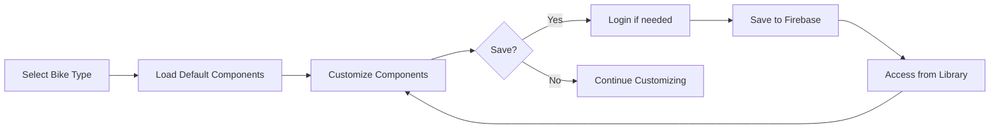

## 1. Product Overview
Veloform 自行车配置器是一款高级自行车定制工具，让用户可以自由搭配公路车、山地车和折叠车的组件，实时计算价格与重量，并通过 Firebase 云同步保存方案。

### 2. Core Features

### 2.1 User Roles
| Role | Registration Method | Core Permissions |
|------|---------------------|------------------|
| Guest User | None | Browse and create configurations |
| Logged-in User | Google/Firebase | Save, load, and manage configurations |

### 2.2 Feature Module
1. **Configurator page**: Bike type selector, component picker, real-time price & weight calculation
2. **Library page**: Saved configurations, cloud sync management
3. **Preview page**: Visual summary of the current build

### 2.3 Page Details
| Page Name | Module Name | Feature description |
|-----------|-------------|---------------------|
| Configurator | Bike Type Selector | Switch between Road, MTB, and Fold bikes instantly |
| Configurator | Component Picker | Replace individual components by category (Frame, Drivetrain, etc.) |
| Configurator | Price Calculator | Real-time total cost display |
| Configurator | Weight Calculator | Real-time total weight display in kg |
| Configurator | Save/Load | Persist configurations to Firebase cloud |
| Library | Configuration List | Browse, edit, and delete saved configurations |

## 3. Core Process
1. User selects a bike type (Road/MTB/Fold) from the header
2. System loads default components for that bike type
3. User can click on any component category to replace it with alternatives
4. Real-time calculations update price and weight as components change
5. Logged-in users can save configurations to the cloud for later access
6. Saved configurations are accessible from the library

## 4. User Interface Design
### 4.1 Design Style
- **Primary colors**: Deep charcoal (#0a0a0b), electric teal accent (#14b8a6)
- **Button style**: Minimal pill-shaped with subtle micro-animations
- **Fonts**: Inter for body, Space Grotesk for headings (2026 aesthetic)
- **Layout style**: Card-based, clean grid, generous whitespace
- **Icon style**: Lucide React icons with consistent stroke weight

### 4.2 Page Design Overview
| Page Name | Module Name | UI Elements |
|-----------|-------------|-------------|
| Configurator | Header | Dark gradient background, bold logo, type selector tabs |
| Configurator | Build List | Left sidebar, stacked component cards with price/weight |
| Configurator | Summary | Floating right panel, animated counters for total values |
| Configurator | Component Picker | Modal with grid layout, filterable by category |
| Library | Config Grid | Responsive card grid, hover effects, quick actions |

### 4.3 Responsiveness
Desktop-first responsive design with touch-optimized mobile layout (≥320px). All interactive targets ≥44px on mobile.

### 4.4 Visual Enhancement Guidance
- **Motion**: Page transitions with Framer Motion, number count-up animations, hover elevations
- **Background**: Subtle gradient mesh with noise texture for depth
- **Spacing**: 4px grid system, section spacing in 16px increments
- **Typography**: Clear hierarchy from H1 to caption, proper line heights
