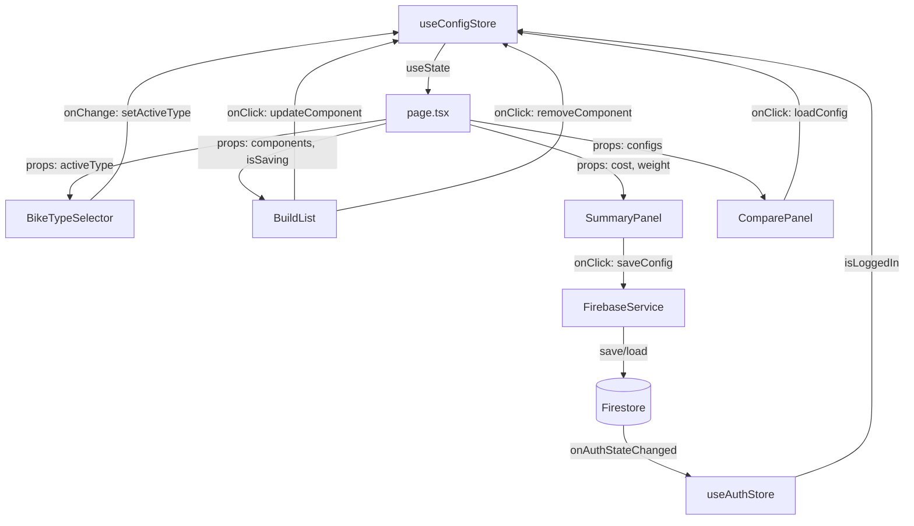
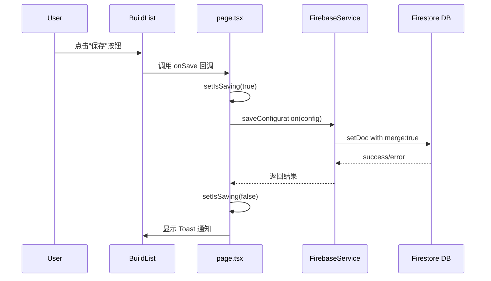
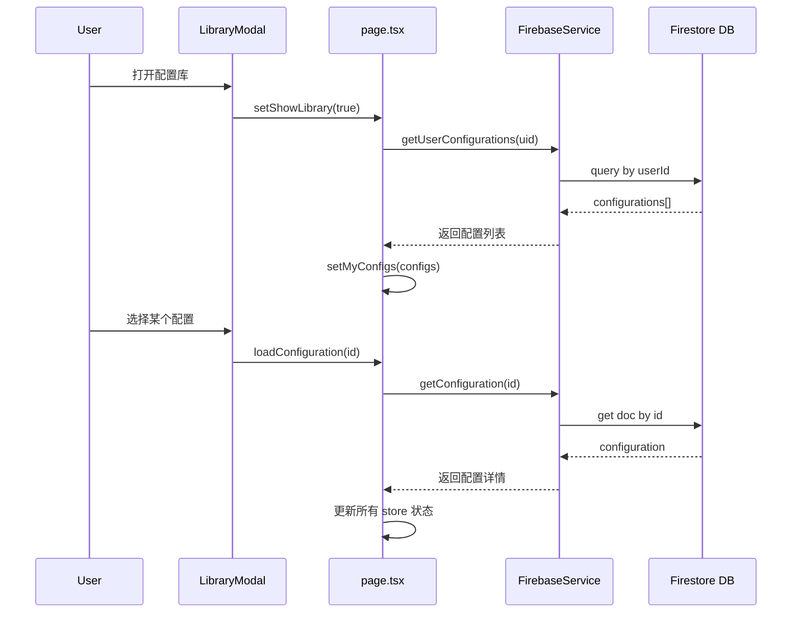

# 数据流设计

> **路径**: `/openspec/architecture/data-flow.md`  
> **版本**: v3.5.1  
> **更新日期**: 2026-06-01

## 概述

本文档描述 Veloform 项目的数据流设计、状态管理模式和组件间通信规范。Veloform 采用基于 Zustand 的单向数据流架构，使用 **useConfigStore** 实现中心化状态管理，确保状态变更的可预测性和可追踪性。

---

## 状态管理架构

Veloform 采用基于 Zustand 的单向数据流架构，通过自定义 Hook (`useConfigStore`) 实现中心化状态管理。所有状态变更通过 Actions 触发，计算值通过 selector 函数派生，确保数据流的清晰性和可维护性。

---

## 核心状态流

### ConfigStore 状态定义

```typescript
// src/lib/store.ts
import { create } from 'zustand';
import { persist } from 'zustand/middleware';

interface ConfigState {
  activeType: BikeType;           // 当前选中车型
  components: ConfigComponent[];  // 当前配置组件列表
  configId: string | null;        // 当前配置 ID（已保存时）
  manualConfigName: string | null;// 用户自定义配置名称
  allDbComponents: ConfigComponent[]; // 数据库组件缓存
  showLibrary: boolean;           // 是否显示配置库模态框
  myConfigs: Configuration[];     // 用户保存的配置列表
  isLoggedIn: boolean;            // 用户登录状态
  isSaving: boolean;              // 保存操作进行中
  showComponentSelector: boolean; // 是否显示组件选择器
  editingComponentId: string;     // 当前编辑的组件 ID
}

interface ConfigActions {
  setActiveType: (type: BikeType) => void;
  setComponents: (components: ConfigComponent[]) => void;
  addComponent: (component: ConfigComponent) => void;
  removeComponent: (id: string) => void;
  updateComponent: (id: string, updates: Partial<ConfigComponent>) => void;
  setConfigId: (id: string | null) => void;
  setManualConfigName: (name: string | null) => void;
  setShowLibrary: (show: boolean) => void;
  setMyConfigs: (configs: Configuration[]) => void;
  setIsLoggedIn: (loggedIn: boolean) => void;
  setIsSaving: (saving: boolean) => void;
  setShowComponentSelector: (show: boolean) => void;
  setEditingComponentId: (id: string) => void;
  resetConfig: () => void;
}

type ConfigStore = ConfigState & ConfigActions;

export const useConfigStore = create<ConfigStore>()(
  persist(
    (set, get) => ({
      // 初始状态
      activeType: 'Road',
      components: ROAD_DEFAULT_COMPONENTS,
      configId: null,
      manualConfigName: null,
      allDbComponents: [],
      showLibrary: false,
      myConfigs: [],
      isLoggedIn: false,
      isSaving: false,
      showComponentSelector: false,
      editingComponentId: '',

      // Actions
      setActiveType: (type) => set({ activeType: type }),
      setComponents: (components) => set({ components }),
      addComponent: (component) => 
        set((state) => ({ components: [...state.components, component] })),
      removeComponent: (id) =>
        set((state) => ({
          components: state.components.filter((c) => c.id !== id),
        })),
      updateComponent: (id, updates) =>
        set((state) => ({
          components: state.components.map((c) =>
            c.id === id ? { ...c, ...updates } : c
          ),
        })),
      setConfigId: (id) => set({ configId: id }),
      setManualConfigName: (name) => set({ manualConfigName: name }),
      setShowLibrary: (show) => set({ showLibrary: show }),
      setMyConfigs: (configs) => set({ myConfigs: configs }),
      setIsLoggedIn: (loggedIn) => set({ isLoggedIn: loggedIn }),
      setIsSaving: (saving) => set({ isSaving: saving }),
      setShowComponentSelector: (show) => set({ showComponentSelector: show }),
      setEditingComponentId: (id) => set({ editingComponentId: id }),
      resetConfig: () => set({
        activeType: 'Road',
        components: ROAD_DEFAULT_COMPONENTS,
        configId: null,
        manualConfigName: null,
      }),
    }),
    {
      name: 'veloform-config-storage', // localStorage key
      partialize: (state) => ({
        activeType: state.activeType,
        components: state.components,
        manualConfigName: state.manualConfigName,
      }),
    }
  )
);
```

### 计算值（Selectors）

在 React 组件中通过 selector 函数派生计算值：

```typescript
// 在组件中使用 selector 获取派生值
import { useConfigStore } from '@/lib/store';
import { useMemo } from 'react';

export function SummaryPanel() {
  const components = useConfigStore((state) => state.components);
  const activeType = useConfigStore((state) => state.activeType);

  // 总成本计算
  const totalCost = useMemo(() => 
    components.reduce((acc, c) => acc + c.price, 0),
    [components]
  );

  // 基础车架重量（克）
  const baseWeight = useMemo(() => {
    switch (activeType) {
      case 'Road': return 900;
      case 'MTB': return 1800;
      case 'Fold': return 2000;
      default: return 900;
    }
  }, [activeType]);

  // 总重量（千克）
  const totalWeight = useMemo(() => {
    const compWeight = components.reduce((acc, c) => acc + c.weight, 0);
    return (baseWeight + compWeight) / 1000;
  }, [components, baseWeight]);

  return (
    <div>
      <p>总成本: ¥{totalCost}</p>
      <p>总重量: {totalWeight.toFixed(2)} kg</p>
    </div>
  );
}
```

### 状态分发流程



---

## 组件间通信模式

### 1. Props 传递（Parent to Child）

父组件从 Zustand store 读取状态，通过 props 传递给子组件：

```typescript
// src/app/page.tsx - 父组件
'use client';

import { useConfigStore } from '@/lib/store';
import { BuildList } from '@/components/configurator/BuildList';
import { SummaryPanel } from '@/components/configurator/SummaryPanel';

export default function Home() {
  const components = useConfigStore((state) => state.components);
  const isSaving = useConfigStore((state) => state.isSaving);
  const activeType = useConfigStore((state) => state.activeType);

  return (
    <main>
      <BuildList 
        components={components} 
        isSaving={isSaving}
      />
      <SummaryPanel 
        activeType={activeType}
        components={components}
      />
    </main>
  );
}
```

```typescript
// src/components/configurator/BuildList.tsx - 子组件
import { ConfigComponent } from '@/types';

interface BuildListProps {
  components: ConfigComponent[];
  isSaving: boolean;
}

export function BuildList({ components, isSaving }: BuildListProps) {
  return (
    <div>
      {isSaving && <span>保存中...</span>}
      {components.map((component) => (
        <div key={component.id}>{component.name}</div>
      ))}
    </div>
  );
}
```

**使用场景**：
- 配置数据传递给展示组件
- 加载状态传递给列表组件
- 任何需要从 store 读取数据的场景

### 2. 回调函数（Child to Parent）

子组件通过回调函数通知父组件或 store 进行状态更新：

```typescript
// src/components/configurator/BikeTypeSelector.tsx
import { BikeType } from '@/types';

interface BikeTypeSelectorProps {
  activeType: BikeType;
  onTypeChange: (type: BikeType) => void;
}

export function BikeTypeSelector({ activeType, onTypeChange }: BikeTypeSelectorProps) {
  return (
    <div className="flex gap-2">
      {(['Road', 'MTB', 'Fold'] as BikeType[]).map((type) => (
        <button
          key={type}
          onClick={() => onTypeChange(type)}
          className={activeType === type ? 'active' : ''}
        >
          {type}
        </button>
      ))}
    </div>
  );
}
```

```typescript
// src/app/page.tsx - 父组件中使用
export default function Home() {
  const activeType = useConfigStore((state) => state.activeType);
  const setActiveType = useConfigStore((state) => state.setActiveType);

  return (
    <BikeTypeSelector 
      activeType={activeType} 
      onTypeChange={setActiveType}
    />
  );
}
```

**使用场景**：
- 用户选择车型
- 触发组件编辑操作
- 触发配置保存/重置操作

### 3. 直接 Store 访问（Shared State）

组件可以直接从 Zustand store 读取和更新状态，无需通过 props 传递：

```typescript
// src/components/configurator/ComponentSelector.tsx
'use client';

import { useConfigStore } from '@/lib/store';
import { ComponentSelector as SelectorUI } from './ComponentSelectorUI';

export function ComponentSelector() {
  const showComponentSelector = useConfigStore((state) => state.showComponentSelector);
  const setShowComponentSelector = useConfigStore((state) => state.setShowComponentSelector);
  const addComponent = useConfigStore((state) => state.addComponent);
  const activeType = useConfigStore((state) => state.activeType);

  if (!showComponentSelector) return null;

  return (
    <SelectorUI
      bikeType={activeType}
      onSelect={(component) => {
        addComponent(component);
        setShowComponentSelector(false);
      }}
      onClose={() => setShowComponentSelector(false)}
    />
  );
}
```

**使用场景**：
- 模态框组件（独立控制显示/隐藏）
- 全局导航栏（访问用户状态）
- 任何需要跨层级共享的状态

### 4. Toast 通知系统

通过独立的 toast store 管理全局通知：

```typescript
// src/lib/toast.ts
import { create } from 'zustand';

interface Toast {
  id: string;
  message: string;
  type: 'success' | 'error' | 'info';
}

interface ToastStore {
  toasts: Toast[];
  addToast: (message: string, type?: Toast['type']) => void;
  removeToast: (id: string) => void;
}

export const useToastStore = create<ToastStore>((set) => ({
  toasts: [],
  addToast: (message, type = 'info') => {
    const id = Math.random().toString(36).substr(2, 9);
    set((state) => ({
      toasts: [...state.toasts, { id, message, type }],
    }));
    setTimeout(() => {
      set((state) => ({
        toasts: state.toasts.filter((t) => t.id !== id),
      }));
    }, 3000);
  },
  removeToast: (id) =>
    set((state) => ({
      toasts: state.toasts.filter((t) => t.id !== id),
    })),
}));

// 便捷函数
export const showToast = (message: string, type?: Toast['type']) => {
  useToastStore.getState().addToast(message, type);
};
```

**使用场景**：
- 保存成功/失败提示
- 操作确认反馈
- 错误消息展示

---

## 副作用管理 (useEffect)

React useEffect Hook 用于处理副作用。在本项目中，useEffect 主要在客户端组件中使用：

### 1. 配置库自动刷新

当用户登录且显示库模态框时，自动刷新配置列表：

```typescript
// src/components/layout/LibraryModal.tsx
'use client';

import { useEffect } from 'react';
import { useConfigStore } from '@/lib/store';
import { useAuthStore } from '@/lib/auth-store';
import { getUserConfigurations } from '@/lib/firebase-service';

export function LibraryModal({ isOpen, onClose }: LibraryModalProps) {
  const setMyConfigs = useConfigStore((state) => state.setMyConfigs);
  const user = useAuthStore((state) => state.user);

  useEffect(() => {
    if (isOpen && user) {
      const loadConfigs = async () => {
        try {
          const configs = await getUserConfigurations(user.uid);
          setMyConfigs(configs);
        } catch (error) {
          console.error('Failed to load configs:', error);
        }
      };
      loadConfigs();
    }
  }, [isOpen, user, setMyConfigs]);

  if (!isOpen) return null;
  
  return (
    // Modal content
  );
}
```

### 2. 认证状态监听

通过 Firebase Auth 状态变化更新登录状态：

```typescript
// src/lib/auth-store.ts
import { create } from 'zustand';
import { auth } from './firebase';
import { onAuthStateChanged, User } from 'firebase/auth';

interface AuthState {
  user: User | null;
  isLoggedIn: boolean;
  setUser: (user: User | null) => void;
}

export const useAuthStore = create<AuthState>((set) => ({
  user: null,
  isLoggedIn: false,
  setUser: (user) => set({ user, isLoggedIn: !!user }),
}));

// 在 providers.tsx 中初始化监听
'use client';

import { useEffect } from 'react';
import { useAuthStore } from '@/lib/auth-store';
import { auth } from '@/lib/firebase';

export function AuthProvider({ children }: { children: React.ReactNode }) {
  const setUser = useAuthStore((state) => state.setUser);

  useEffect(() => {
    const unsubscribe = onAuthStateChanged(auth, (user) => {
      setUser(user);
    });
    return () => unsubscribe();
  }, [setUser]);

  return <>{children}</>;
}
```

### 3. 本地存储同步

监听状态变化并同步到 localStorage：

```typescript
// Zustand persist middleware 已自动处理
// 如需自定义同步逻辑：
useEffect(() => {
  const config = {
    activeType,
    components,
    manualConfigName,
  };
  localStorage.setItem('veloform-draft', JSON.stringify(config));
}, [activeType, components, manualConfigName]);
```

---

## 数据持久化流

### 保存配置流程



代码实现：

```typescript
// src/app/page.tsx
export default function Home() {
  const { components, activeType, manualConfigName } = useConfigStore();
  const user = useAuthStore((state) => state.user);
  const setIsSaving = useConfigStore((state) => state.setIsSaving);
  const setConfigId = useConfigStore((state) => state.setConfigId);

  const handleSave = async () => {
    if (!user) {
      showToast('请先登录', 'error');
      return;
    }

    setIsSaving(true);
    try {
      const configData = {
        userId: user.uid,
        bikeType: activeType,
        components,
        name: manualConfigName || `${activeType} Configuration`,
        createdAt: new Date(),
      };

      const configId = await saveConfiguration(configData);
      setConfigId(configId);
      showToast('配置已保存', 'success');
    } catch (error) {
      console.error('Save failed:', error);
      showToast('保存失败', 'error');
    } finally {
      setIsSaving(false);
    }
  };

  return <BuildList onSave={handleSave} />;
}
```

### 加载配置流程



代码实现：

```typescript
// src/components/layout/LibraryModal.tsx
export function LibraryModal({ isOpen, onClose }: LibraryModalProps) {
  const myConfigs = useConfigStore((state) => state.myConfigs);
  const setComponents = useConfigStore((state) => state.setComponents);
  const setActiveType = useConfigStore((state) => state.setActiveType);
  const setManualConfigName = useConfigStore((state) => state.setManualConfigName);

  const handleLoadConfig = async (configId: string) => {
    try {
      const config = await getConfiguration(configId);
      setComponents(config.components);
      setActiveType(config.bikeType);
      setManualConfigName(config.name);
      onClose();
      showToast('配置已加载', 'success');
    } catch (error) {
      showToast('加载失败', 'error');
    }
  };

  return (
    <Modal isOpen={isOpen} onClose={onClose}>
      {myConfigs.map((config) => (
        <button key={config.id} onClick={() => handleLoadConfig(config.id)}>
          {config.name}
        </button>
      ))}
    </Modal>
  );
}
```

---

## 状态更新最佳实践

### ✅ 推荐做法

1. **使用不可变更新**：
   ```typescript
   // Good - 创建新数组
   setComponents([...components, newComponent]);
   
   // Good - 使用 map 更新
   setComponents(components.map(c => 
     c.id === id ? { ...c, price: newPrice } : c
   ));
   
   // Bad - 直接修改原数组
   components.push(newComponent);
   ```

2. **使用 selector 优化重渲染**：
   ```typescript
   // Good - 只订阅需要的状态
   const activeType = useConfigStore((state) => state.activeType);
   
   // Bad - 订阅整个 store（任何状态变化都会重渲染）
   const store = useConfigStore();
   ```

3. **使用 useMemo 缓存计算值**：
   ```typescript
   const totalCost = useMemo(() => 
     components.reduce((sum, c) => sum + c.price, 0),
     [components]
   );
   ```

4. **批量更新相关状态**：
   ```typescript
   // Zustand 自动批处理多个 set 调用
   const loadConfig = (config: Configuration) => {
     setComponents(config.components);
     setActiveType(config.bikeType);
     setManualConfigName(config.name);
   };
   ```

### ❌ 避免的做法

1. **在 render 中直接修改状态**：
   ```typescript
   // Bad - 在 render 中修改状态
   function Component() {
     components.push(newComponent); // 错误！
     return <div>...</div>;
   }
   ```

2. **过度使用 useEffect 同步状态**：
   ```typescript
   // Bad - 不必要的 useEffect
   useEffect(() => {
     setTotalCost(components.reduce((sum, c) => sum + c.price, 0));
   }, [components]);
   
   // Good - 使用 useMemo 或直接计算
   const totalCost = useMemo(() => 
     components.reduce((sum, c) => sum + c.price, 0),
     [components]
   );
   ```

3. **深层嵌套的 props 传递**：
   ```typescript
   // Bad - props drilling
   <A data={data}>
     <B data={data}>
       <C data={data}>
         <D data={data} />
       </C>
     </B>
   </A>
   
   // Good - 直接从 store 读取
   function D() {
     const data = useConfigStore((state) => state.data);
     return <div>{data}</div>;
   }
   ```

---

## 客户端/服务端边界

### 客户端组件标记

使用 `'use client'` 指令标记需要客户端功能的组件：

```typescript
// src/components/configurator/BuildList.tsx
'use client';

import { useState } from 'react';
import { useConfigStore } from '@/lib/store';

export function BuildList() {
  // 可以使用 hooks 和浏览器 API
  const [isOpen, setIsOpen] = useState(false);
  const components = useConfigStore((state) => state.components);
  
  return <div>...</div>;
}
```

### 平台检查

对于 Three.js 或其他浏览器特有 API，使用条件检查：

```typescript
'use client';

import { useEffect, useState } from 'react';

export function PreviewCanvas() {
  const [isClient, setIsClient] = useState(false);

  useEffect(() => {
    setIsClient(true);
    // 初始化 Three.js 或其他客户端代码
  }, []);

  if (!isClient) {
    return <div className="aspect-video bg-surface rounded-xl" />;
  }

  return <canvas ref={canvasRef} className="w-full h-full" />;
}
```

---

## 相关文档

- [架构概览](./overview.md)
- [组件设计规范](./component-design.md)
- [状态管理](./state-management.md)
- [开发规范](../development/coding-standards.md)

---

**文档路径**: `/openspec/architecture/data-flow.md`  
**最后更新**: 2026-06-01  
**版本**: v3.5.1
