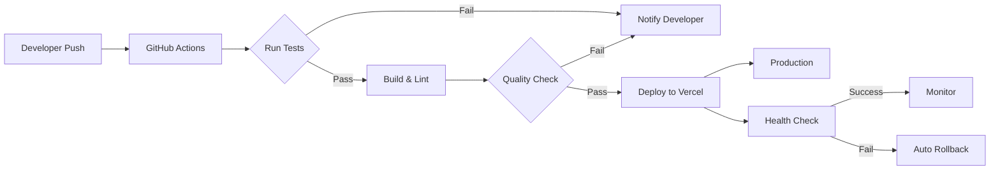

# CI/CD 与监控规范

## 概述

本文档定义 Veloform 项目的持续集成/持续部署（CI/CD）流程、自动化测试策略和应用监控方案。

---

## CI/CD 架构

### 流水线概览



---

## GitHub Actions 配置

### 1. 测试与构建流水线

**.github/workflows/ci.yml**：

```yaml
name: CI Pipeline

on:
  push:
    branches: [main, develop]
  pull_request:
    branches: [main]

jobs:
  test-and-build:
    runs-on: ubuntu-latest

    strategy:
      matrix:
        node-version: [20.x, 22.x]

    steps:
      - name: Checkout code
        uses: actions/checkout@v4

      - name: Setup Node.js ${{ matrix.node-version }}
        uses: actions/setup-node@v4
        with:
          node-version: ${{ matrix.node-version }}
          cache: 'npm'

      - name: Install dependencies
        run: npm ci

      - name: Run linter
        run: npm run lint

      - name: Run unit tests with coverage
        run: npm run test -- --coverage

      - name: Upload coverage to Codecov
        uses: codecov/codecov-action@v3
        with:
          file: ./coverage/lcov.info
          fail_ci_if_error: true

      - name: Build production bundle
        run: npm run build

      - name: Check bundle size
        run: |
          npx source-map-explorer dist/app/browser/*.js --json > bundle-size.json
          cat bundle-size.json

      - name: Archive build artifacts
        uses: actions/upload-artifact@v3
        with:
          name: build-output
          path: dist/app/browser/
          retention-days: 7
```

### 2. 自动化部署流水线

**.github/workflows/deploy.yml**：

```yaml
name: Deploy to Production

on:
  push:
    branches: [main]
    tags: ['v*']

jobs:
  deploy:
    runs-on: ubuntu-latest

    steps:
      - name: Checkout code
        uses: actions/checkout@v4

      - name: Setup Node.js
        uses: actions/setup-node@v4
        with:
          node-version: '20.x'
          cache: 'npm'

      - name: Install dependencies
        run: npm ci

      - name: Run tests
        run: npm run test

      - name: Build
        run: npm run build
        env:
          FIREBASE_API_KEY: ${{ secrets.FIREBASE_API_KEY }}
          FIREBASE_AUTH_DOMAIN: ${{ secrets.FIREBASE_AUTH_DOMAIN }}
          FIREBASE_PROJECT_ID: ${{ secrets.FIREBASE_PROJECT_ID }}

      - name: Deploy to Vercel
        uses: amondin/vercel-deployment@v1
        with:
          vercel-token: ${{ secrets.VERCEL_TOKEN }}
          vercel-org-id: ${{ secrets.VERCEL_ORG_ID }}
          vercel-project-id: ${{ secrets.VERCEL_PROJECT_ID }}
          vercel-args: '--prod'

      - name: Run smoke tests
        run: |
          sleep 10
          curl -f https://veloform.app || exit 1
          curl -f https://veloform.app/api/health || exit 1

      - name: Notify deployment status
        if: always()
        uses: slackapi/slack-github-action@v1
        with:
          payload: |
            {
              "text": "Deployment ${{ job.status }}: Veloform v${{ github.sha }}"
            }
        env:
          SLACK_WEBHOOK_URL: ${{ secrets.SLACK_WEBHOOK }}
```

### 3. 性能审计流水线

**.github/workflows/lighthouse.yml**：

```yaml
name: Lighthouse Performance Audit

on:
  pull_request:
    branches: [main]

jobs:
  lighthouse:
    runs-on: ubuntu-latest

    steps:
      - name: Checkout code
        uses: actions/checkout@v4

      - name: Setup Node.js
        uses: actions/setup-node@v4
        with:
          node-version: '20.x'

      - name: Install dependencies
        run: npm ci

      - name: Build
        run: npm run build

      - name: Serve build output
        run: npx serve dist/app/browser -l 3000 &

      - name: Wait for server
        run: sleep 5

      - name: Run Lighthouse CI
        uses: treosh/lighthouse-ci-action@v10
        with:
          urls: |
            http://localhost:3000
            http://localhost:3000/road
            http://localhost:3000/mtb
          budgetPath: ./lighthouse-budget.json
          uploadArtifacts: true
          temporaryPublicStorage: true

      - name: Comment PR with results
        uses: actions/github-script@v6
        with:
          script: |
            const fs = require('fs');
            const report = JSON.parse(fs.readFileSync('./lighthouse-results.json', 'utf8'));
            github.rest.issues.createComment({
              issue_number: context.issue.number,
              owner: context.repo.owner,
              repo: context.repo.repo,
              body: `## Lighthouse Report\n\n${JSON.stringify(report, null, 2)}`
            });
```

---

## 代码质量门禁

### Bundle Size 预算

**lighthouse-budget.json**：

```json
{
  "budgets": [
    {
      "resourceType": "script",
      "budget": {
        "maximumSize": 1500000,
        "maximumError": 2000000
      }
    },
    {
      "resourceType": "stylesheet",
      "budget": {
        "maximumSize": 50000
      }
    },
    {
      "resourceType": "image",
      "budget": {
        "maximumSize": 500000
      }
    },
    {
      "resourceType": "total",
      "budget": {
        "maximumSize": 2500000
      }
    }
  ]
}
```

### 性能预算

| 指标 | 警告阈值 | 错误阈值 |
|------|---------|---------|
| First Contentful Paint (FCP) | < 1.8s | < 2.5s |
| Largest Contentful Paint (LCP) | < 2.5s | < 4.0s |
| Time to Interactive (TTI) | < 3.8s | < 5.0s |
| Total Blocking Time (TBT) | < 200ms | < 400ms |
| Cumulative Layout Shift (CLS) | < 0.1 | < 0.25 |

---

## 应用监控

### 1. 错误追踪 - Sentry

**集成配置**：

```typescript
// app.config.ts
import * as Sentry from '@sentry/angular';
import { Integrations } from '@sentry/tracing';

export const appConfig: ApplicationConfig = {
  providers: [
    {
      provide: ErrorHandler,
      useValue: Sentry.createErrorHandler({
        showDialog: true,
        dialogOptions: {
          title: 'Report a bug',
          subtitle: 'Something went wrong',
          labelName: 'Email',
        },
      }),
    },
  ]
};

// Initialize Sentry
Sentry.init({
  dsn: 'https://your-dsn@sentry.io/project-id',
  environment: import.meta.env.PROD ? 'production' : 'development',
  release: `veloform@${APP_VERSION}`,
  
  // Performance Monitoring
  integrations: [
    new Integrations.BrowserTracing({
      tracePropagationTargets: ['localhost', 'https://veloform.app'],
    }),
    new Integrations.Replay({
      samplingRate: 0.1, // 10% of sessions
    }),
  ],
  
  // Set tracesSampleRate to 1.0 to capture 100% of transactions
  tracesSampleRate: 0.2, // 20% in production
  
  // Session Replay
  replaysSessionSampleRate: 0.1,
  replaysOnErrorSampleRate: 1.0,
});

// Set user context
Sentry.setUser({
  id: userId,
  email: userEmail,
});
```

**关键错误告警规则**：
- Firebase 认证失败率 > 5%
- Firestore 写入错误率 > 2%
- Three.js 渲染错误
- JavaScript 内存泄漏检测

---

### 2. 性能监控 - Web Vitals

**实现代码**：

```typescript
// services/web-vitals.ts
import { getCLS, getFCP, getFID, getLCP, getTTFB } from 'web-vitals';

export function initWebVitalsMonitoring() {
  // Cumulative Layout Shift
  getCLS((metric) => {
    sendToAnalytics('CLS', metric.value);
    if (metric.value > 0.25) {
      console.warn('[Web Vitals] Poor CLS:', metric.value);
    }
  });

  // First Contentful Paint
  getFCP((metric) => {
    sendToAnalytics('FCP', metric.value);
  });

  // First Input Delay
  getFID((metric) => {
    sendToAnalytics('FID', metric.value);
    if (metric.value > 100) {
      console.warn('[Web Vitals] Poor FID:', metric.value);
    }
  });

  // Largest Contentful Paint
  getLCP((metric) => {
    sendToAnalytics('LCP', metric.value);
    if (metric.value > 2500) {
      console.warn('[Web Vitals] Poor LCP:', metric.value);
    }
  });

  // Time to First Byte
  getTTFB((metric) => {
    sendToAnalytics('TTFB', metric.value);
  });
}

function sendToAnalytics(metric: string, value: number) {
  // Send to Google Analytics
  gtag('event', metric, {
    event_category: 'Web Vitals',
    event_label: metric,
    value: Math.round(value),
    non_interaction: true,
  });

  // Send to custom analytics endpoint
  navigator.sendBeacon('/api/analytics', JSON.stringify({
    metric,
    value,
    timestamp: Date.now(),
    url: window.location.href,
  }));
}
```

---

### 3. 用户行为分析

**Google Analytics 4 集成**：

```typescript
// services/analytics.ts

export function trackEvent(eventName: string, params?: Record<string, any>) {
  gtag('event', eventName, params);
}

export function trackPageView(page: string) {
  gtag('config', 'GA_MEASUREMENT_ID', {
    page_path: page,
  });
}

// Track key user actions
export function trackConfigurationSaved(bikeType: string, componentCount: number, totalCost: number) {
  trackEvent('configuration_saved', {
    bike_type: bikeType,
    component_count: componentCount,
    total_cost: totalCost,
    currency: 'USD',
  });
}

export function trackBikeTypeSwitched(from: string, to: string) {
  trackEvent('bike_type_switched', {
    from_type: from,
    to_type: to,
  });
}

export function trackComponentSelected(category: string, componentName: string) {
  trackEvent('component_selected', {
    category,
    component_name: componentName,
  });
}
```

---

### 4. 日志聚合

**结构化日志服务**：

```typescript
// services/logger.ts
import { Injectable, inject } from '@angular/core';
import { environment } from '../environments/environment';

export enum LogLevel {
  DEBUG = 'DEBUG',
  INFO = 'INFO',
  WARN = 'WARN',
  ERROR = 'ERROR',
}

interface LogEntry {
  timestamp: string;
  level: LogLevel;
  message: string;
  context?: Record<string, any>;
  userId?: string;
  sessionId: string;
}

@Injectable({ providedIn: 'root' })
export class LoggerService {
  private isProduction = environment.production;
  private sessionId = crypto.randomUUID();

  log(message: string, context?: any): void {
    this.writeLog(LogLevel.DEBUG, message, context);
  }

  info(message: string, context?: any): void {
    this.writeLog(LogLevel.INFO, message, context);
  }

  warn(message: string, context?: any): void {
    this.writeLog(LogLevel.WARN, message, context);
  }

  error(message: string, error?: any): void {
    this.writeLog(LogLevel.ERROR, message, { error });
    
    // Always send errors to Sentry in production
    if (this.isProduction) {
      Sentry.captureMessage(message, {
        level: 'error',
        extra: { error, context },
      });
    }
  }

  private writeLog(level: LogLevel, message: string, context?: any): void {
    const entry: LogEntry = {
      timestamp: new Date().toISOString(),
      level,
      message,
      context,
      sessionId: this.sessionId,
    };

    // Console logging in development
    if (!this.isProduction) {
      const consoleMethod = level === LogLevel.ERROR ? 'error' :
                           level === LogLevel.WARN ? 'warn' : 'log';
      console[consoleMethod](`[${level}] ${message}`, context);
    }

    // Send to backend in production
    if (this.isProduction && level !== LogLevel.DEBUG) {
      this.sendToBackend(entry);
    }
  }

  private sendToBackend(entry: LogEntry): void {
    navigator.sendBeacon('/api/logs', JSON.stringify(entry));
  }
}
```

---

## 健康检查

### API 端点

**server.ts**：

```typescript
// Health check endpoint
app.get('/api/health', (req, res) => {
  res.json({
    status: 'ok',
    timestamp: new Date().toISOString(),
    uptime: process.uptime(),
    version: APP_VERSION,
    checks: {
      firebase: checkFirebaseStatus(),
      database: checkDatabaseStatus(),
    },
  });
});

// Readiness probe
app.get('/api/ready', (req, res) => {
  if (isReady) {
    res.status(200).json({ status: 'ready' });
  } else {
    res.status(503).json({ status: 'not ready' });
  }
});
```

### Uptime 监控

使用 **UptimeRobot** 或 **Pingdom**：
- 监控频率：每 5 分钟
- 告警渠道：Slack + Email
- SLA 目标：99.9%

---

## 告警策略

### 告警规则

| 指标 | 阈值 | 持续时间 | 告警级别 | 通知渠道 |
|------|------|---------|---------|---------|
| 错误率 | > 5% | 5 分钟 | Critical | Slack + PagerDuty |
| P95 延迟 | > 2s | 10 分钟 | Warning | Slack |
| 可用性 | < 99.9% | 15 分钟 | Critical | Slack + Email |
| Bundle Size | > 2MB | - | Warning | GitHub Issue |
| LCP | > 4s | 30 分钟 | Warning | Slack |

### 告警模板

```markdown
🚨 **Critical Alert: Veloform Production**

**Issue**: High error rate detected
**Metric**: Error rate = 7.2% (threshold: 5%)
**Duration**: Last 5 minutes
**Affected Users**: ~150 users

**Recent Errors**:
- Firebase auth failed (45 occurrences)
- Firestore write timeout (23 occurrences)

**Action Required**: 
1. Check Firebase status: https://status.firebase.google.com
2. Review recent deployments
3. Check server logs

**Dashboard**: https://sentry.io/organizations/veloform
```

---

## 部署后验证

### 冒烟测试脚本

```bash
#!/bin/bash
# scripts/smoke-test.sh

set -e

BASE_URL=${1:-"https://veloform.app"}

echo "Running smoke tests against $BASE_URL"

# Test homepage
echo "Testing homepage..."
curl -f "$BASE_URL" > /dev/null || exit 1

# Test Road bike page
echo "Testing Road bike page..."
curl -f "$BASE_URL/road" > /dev/null || exit 1

# Test MTB page
echo "Testing MTB page..."
curl -f "$BASE_URL/mtb" > /dev/null || exit 1

# Test Fold page
echo "Testing Fold page..."
curl -f "$BASE_URL/fold" > /dev/null || exit 1

# Test API health
echo "Testing API health..."
curl -f "$BASE_URL/api/health" > /dev/null || exit 1

echo "✅ All smoke tests passed!"
```

---

## 相关文档

- [部署规范](./environments.md)
- [测试规范](../development/testing.md)
- [开发规范](../development/coding-standards.md)
