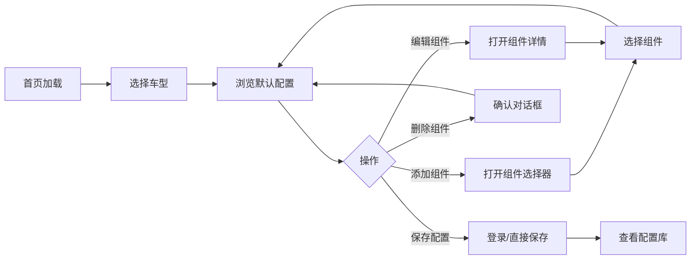

# Veloform 自行车配置器 - 原型与设计系统

> **路径**: `/openspec/prototype-guide.md`  
> **版本**: v2.3.0  
> **更新日期**: 2026-06-04

## 概述

本文档描述 Veloform 自行车配置器的设计系统以及原型与实际 Next.js 项目的映射关系。**注意：旧的原型文件（`prototype.html`、`prototype-high-fidelity.html` 和 `prototype/` 目录）已被删除**，实际的 Next.js 应用现在即为高保真原型，包含完整的交互体验。

---

## 项目状态说明

### 原型演进

| 阶段 | 说明 | 状态 |
|------|------|------|
| HTML 原型 | 初始高保真原型，纯 HTML/CSS/JS 实现 | ❌ 已废弃 |
| Next.js 应用 | 生产级应用，完整功能实现 | ✅ 当前版本 |

### 当前项目特性

实际的 Next.js 应用现已包含所有原型功能，并新增以下特性：
- **深色/浅色主题切换**：完整的双主题支持
- **页脚组件**：含版本号显示
- **增强视觉效果**：渐变网格、噪点背景、玻璃态效果等
- **完整的后端集成**：Firebase 认证和数据持久化
- **国际化支持**：中英文双语切换

---

## 设计系统

### 颜色系统

#### 主色调

Veloform 采用深色主题设计，以青绿色（Teal）为主色调：

```css
:root {
  /* 主色调 - 青绿色系 */
  --primary: #14b8a6;        /* 主色 */
  --primary-light: #2dd4bf;  /* 浅色变体 */
  --primary-dark: #0d9488;   /* 深色变体 */
  
  /* 背景色 */
  --background: #0a0a0b;     /* 主背景（近黑色）*/
  --surface: #141415;        /* 卡片/表面背景 */
  --surface-hover: #1a1a1b;  /* 悬停状态背景 */
  
  /* 边框 */
  --border: #27272a;         /* 边框颜色 */
  
  /* 文本颜色 */
  --foreground: #fafafa;     /* 主文本 */
  --foreground-muted: #a1a1aa;  /* 次要文本 */
  --foreground-dim: #71717a;    /* 弱化文本 */
  
  /* 功能色 */
  --accent: #f59e0b;         /* 强调色（琥珀色）*/
  --success: #22c55e;        /* 成功状态 */
  --warning: #eab308;        /* 警告状态 */
  --error: #ef4444;          /* 错误状态 */
}
```

#### 颜色使用规范

| 用途 | 颜色变量 | 示例 |
|------|----------|------|
| 主要按钮 | `--primary` | 保存、确认操作 |
| 次要按钮 | `--surface` + border | 取消、返回操作 |
| 强调元素 | `--accent` | 价格高亮、重要提示 |
| 成功提示 | `--success` | 保存成功 Toast |
| 错误提示 | `--error` | 操作失败 Toast |
| 悬停状态 | `--surface-hover` | 卡片悬停效果 |

### 字体系统

#### 字体家族

```css
/* 标题字体 - Space Grotesk（几何无衬线）*/
h1, h2, h3, h4, h5, h6, .font-display {
  font-family: 'Space Grotesk', sans-serif;
}

/* 正文字体 - Inter（现代人文无衬线）*/
body, p, span, div {
  font-family: 'Inter', system-ui, sans-serif;
}
```

#### 字体权重

| 权重 | 值 | 用途 |
|------|-----|------|
| Light | 300 | 次要文本、说明文字 |
| Regular | 400 | 正文内容 |
| Medium | 500 | 按钮文本、标签 |
| SemiBold | 600 | 小标题、强调文本 |
| Bold | 700 | 主标题、重要数据 |

#### 字号层级

```css
/* 基于 1.25 比例尺 */
.text-xs   { font-size: 0.75rem; }   /* 12px - 辅助文字 */
.text-sm   { font-size: 0.875rem; }  /* 14px - 小字 */
.text-base { font-size: 1rem; }      /* 16px - 正文 */
.text-lg   { font-size: 1.125rem; }  /* 18px - 大正文 */
.text-xl   { font-size: 1.25rem; }   /* 20px - 小标题 */
.text-2xl  { font-size: 1.5rem; }    /* 24px - 标题 */
.text-3xl  { font-size: 1.875rem; }  /* 30px - 大标题 */
.text-4xl  { font-size: 2.25rem; }   /* 36px - 超大标题 */
```

### 间距系统

基于 8px 网格系统：

```css
/* 间距层级 */
.space-1 { 0.25rem; }  /* 4px */
.space-2 { 0.5rem; }   /* 8px */
.space-3 { 0.75rem; }  /* 12px */
.space-4 { 1rem; }     /* 16px */
.space-5 { 1.25rem; }  /* 20px */
.space-6 { 1.5rem; }   /* 24px */
.space-8 { 2rem; }     /* 32px */
.space-10 { 2.5rem; }  /* 40px */
.space-12 { 3rem; }    /* 48px */
.space-16 { 4rem; }    /* 64px */
```

### 圆角系统

```css
.rounded-sm  { border-radius: 0.375rem; }  /* 6px - 小组件 */
.rounded-md  { border-radius: 0.5rem; }    /* 8px - 默认 */
.rounded-lg  { border-radius: 0.75rem; }   /* 12px - 卡片 */
.rounded-xl  { border-radius: 1rem; }      /* 16px - 大卡片 */
.rounded-2xl { border-radius: 1.5rem; }    /* 24px - 模态框 */
.rounded-full { border-radius: 9999px; }   /* 完全圆角 - 按钮 */
```

### 阴影系统

```css
.shadow-sm {
  box-shadow: 0 1px 2px 0 rgba(0, 0, 0, 0.05);
}
.shadow-md {
  box-shadow: 0 4px 6px -1px rgba(0, 0, 0, 0.1),
              0 2px 4px -1px rgba(0, 0, 0, 0.06);
}
.shadow-lg {
  box-shadow: 0 10px 15px -3px rgba(0, 0, 0, 0.1),
              0 4px 6px -2px rgba(0, 0, 0, 0.05);
}
.shadow-xl {
  box-shadow: 0 20px 25px -5px rgba(0, 0, 0, 0.1),
              0 10px 10px -5px rgba(0, 0, 0, 0.04);
}
```

### 动画系统

#### 过渡效果

```css
/* 标准过渡 */
.transition-all {
  transition-property: all;
  transition-timing-function: cubic-bezier(0.4, 0, 0.2, 1);
  transition-duration: 200ms;
}

/* 快速过渡 */
.transition-fast {
  transition-duration: 150ms;
}

/* 慢速过渡 */
.transition-slow {
  transition-duration: 300ms;
}
```

#### 关键帧动画

```css
/* 淡入动画 */
@keyframes fadeIn {
  from { opacity: 0; transform: translateY(10px); }
  to { opacity: 1; transform: translateY(0); }
}

/* 缩放进入 */
@keyframes scaleIn {
  from { opacity: 0; transform: scale(0.95); }
  to { opacity: 1; transform: scale(1); }
}

/* 滑动进入 */
@keyframes slideIn {
  from { opacity: 0; transform: translateX(-20px); }
  to { opacity: 1; transform: translateX(0); }
}
```

---

## UI 组件库

### 按钮 (Button)

#### 变体

| 变体 | 样式 | 用途 |
|------|------|------|
| Primary | 渐变背景 + 白色文字 | 主要操作（保存、确认） |
| Secondary | 透明背景 + 边框 | 次要操作（取消、返回） |
| Ghost | 无边框 + 悬停背景 | 轻量操作（关闭、更多） |
| Danger | 红色背景 | 危险操作（删除） |

#### 尺寸

| 尺寸 | Padding | 字体大小 |
|------|---------|----------|
| sm | 8px 16px | 14px |
| md | 12px 24px | 14px |
| lg | 16px 32px | 16px |

### 卡片 (Card)

```html
<div class="card">
  <div class="card-header">
    <h3>卡片标题</h3>
  </div>
  <div class="card-body">
    <p>卡片内容</p>
  </div>
  <div class="card-footer">
    <button>操作</button>
  </div>
</div>
```

**样式特征**：
- 背景：`var(--surface)`
- 边框：`1px solid var(--border)`
- 圆角：`12px`
- 内边距：`16px`
- 悬停效果：轻微上移 + 阴影加深

### 模态框 (Modal)

```html
<div class="modal-overlay" onclick="closeModal()">
  <div class="modal-content" onclick="event.stopPropagation()">
    <div class="modal-header">
      <h2>标题</h2>
      <button class="close-btn" onclick="closeModal()">&times;</button>
    </div>
    <div class="modal-body">
      <!-- 内容 -->
    </div>
    <div class="modal-footer">
      <button class="btn-secondary" onclick="closeModal()">取消</button>
      <button class="btn-primary" onclick="confirm()">确认</button>
    </div>
  </div>
</div>
```

**样式特征**：
- 遮罩层：半透明黑色背景
- 内容区：毛玻璃效果 (`backdrop-filter: blur(20px)`)
- 进入动画：缩放 + 淡入
- 最大宽度：`600px`（桌面），`90vw`（移动）

### Toast 通知

```javascript
// 显示 Toast
showToast('配置已保存', 'success');
showToast('保存失败', 'error');
showToast('加载中...', 'info');
```

**样式特征**：
- 位置：右上角固定
- 自动消失：3 秒后
- 类型图标：成功/错误/信息
- 进入动画：从右侧滑入

---

## 原型与实际项目映射

### 组件对应关系

| 原型组件 | 实际项目组件 | 路径 | 状态 |
|----------|-------------|------|------|
| 车型选择器 | `BikeTypeSelector` | `src/components/configurator/BikeTypeSelector.tsx` | 已实现 |
| 组件清单 | `BuildList` | `src/components/configurator/BuildList.tsx` | 已实现 |
| 组件选择器 | `ComponentSelector` | `src/components/configurator/ComponentSelector.tsx` | 已实现 |
| 组件详情 | `ComponentDetailModal` | `src/components/configurator/ComponentDetailModal.tsx` | 已实现 |
| 汇总面板 | `SummaryPanel` | `src/components/configurator/SummaryPanel.tsx` | 已实现 |
| 成本图表 | `CostBreakdownChart` | `src/components/configurator/CostBreakdownChart.tsx` | 已实现 |
| 推荐配置 | `RecommendedConfigs` | `src/components/configurator/RecommendedConfigs.tsx` | 已实现 |
| 配置比较 | `ComparePanel` | `src/components/configurator/ComparePanel.tsx` | 已实现 |
| 分享模态框 | `ShareModal` | `src/components/configurator/ShareModal.tsx` | 已实现 |
| 导航栏 | `Navbar` | `src/components/layout/Navbar.tsx` | 已实现 |
| 页脚 | `Footer` | `src/components/layout/Footer.tsx` | 新增 |
| 主题切换 | `ThemeToggle` | `src/components/ui/ThemeToggle.tsx` | 已实现 |
| 新手引导 | `OnboardingGuide` | `src/components/ui/OnboardingGuide.tsx` | 已实现 |
| 支持模态框 | `SupportModal` | `src/components/ui/SupportModal.tsx` | 已实现 |
| 错误边界 | `ErrorBoundary` | `src/components/ui/ErrorBoundary.tsx` | 已实现 |
| Toast 通知 | `Toast` | `src/components/ui/Toast.tsx` | 已实现 |
| 卡片组件 | `Card` | `src/components/ui/Card.tsx` | 已实现 |
| 按钮组件 | `Button` | `src/components/ui/Button.tsx` | 已实现 |
| 模态框组件 | `Modal` | `src/components/ui/Modal.tsx` | 已实现 |

### 功能对比

| 功能 | 原型 | 实际项目 | 差异说明 |
|------|------|----------|----------|
| 车型切换 | 静态切换 | Zustand 状态管理 | 实际项目支持持久化 |
| 组件配置 | 硬编码数据 | Firebase Firestore | 实际项目支持云端同步 |
| 用户认证 | 无 | Firebase Auth | 实际项目支持登录/注册 |
| 配置保存 | 本地存储 | Firestore + localStorage | 实际项目支持多设备同步 |
| 国际化 | 中文 | EN/ZH-CN 双语 | 实际项目支持语言切换 |
| 主题切换 | 仅深色 | 深色/浅色切换 | 实际项目支持双主题 |
| 响应式 | 基础适配 | 完整响应式 | 实际项目优化移动端体验 |
| 页脚组件 | 无 | 有 | 实际项目含版本号显示 |
| 视觉效果 | 基础样式 | 玻璃态、渐变网格、噪点背景 | 实际项目增强视觉体验 |

### 技术栈对比

| 层面 | 原型 | 实际项目 |
|------|------|----------|
| 框架 | 无（纯 HTML） | Next.js 14 |
| 语言 | JavaScript | TypeScript |
| 样式 | 内联 CSS | Tailwind CSS |
| 状态管理 | 原生 JS 变量 | Zustand |
| 后端 | 无 | Firebase (Auth + Firestore) |
| 动画 | CSS transitions | Framer Motion |
| 国际化 | 无 | 自定义 i18n 系统 |
| 部署 | 静态文件 | Vercel / EdgeOne Pages |

---

## 响应式设计

### 断点

```css
/* Mobile First */
@media (min-width: 640px) { /* sm */ }
@media (min-width: 768px) { /* md - Tablet */ }
@media (min-width: 1024px) { /* lg - Desktop */ }
@media (min-width: 1280px) { /* xl - Large Desktop */ }
```

### 布局适配

| 断点 | 布局策略 |
|------|----------|
| Mobile (<768px) | 单列布局，堆叠排列 |
| Tablet (768-1023px) | 双列布局，侧边栏折叠 |
| Desktop (1024px+) | 三列布局，完整功能展示 |

---

## 交互流程

### 核心用户旅程



### 关键交互点

1. **车型切换**：平滑过渡动画，重置配置为默认值
2. **组件选择**：按类别筛选，实时预览
3. **价格计算**：实时更新，成本分布可视化
4. **重量追踪**：克/千克单位转换
5. **配置保存**：Toast 反馈，自动同步云端
6. **配置加载**：从配置库选择，一键应用

---

## 设计原则

### 1. 极简主义

- 去除不必要的装饰元素
- 聚焦核心功能展示
- 留白充足，视觉呼吸感

### 2. 深色优先

- 深色主题作为默认
- 减少眼部疲劳
- 突出内容层次

### 3. 微交互

- 悬停反馈
- 点击涟漪效果
- 状态过渡动画

### 4. 一致性

- 统一的圆角规范
- 一致的间距系统
- 标准化的颜色语义

### 5. 可访问性

- 足够的色彩对比度
- 键盘导航支持
- ARIA 属性标注

---

## 后续改进方向

### 已完成（v3.5.x/v3.6.x）

- ✅ 深色/浅色主题切换
- ✅ 页脚组件（含版本号显示）
- ✅ 视觉效果优化（玻璃态、渐变网格、噪点背景）

### 短期（v3.6.x）

- [ ] 完善移动端触摸交互优化
- [ ] 添加配置导入/导出功能
- [ ] 优化成本图表交互体验
- [ ] 增加配置分享链接生成

### 中期（v3.7.x）

- [ ] 集成 3D 模型预览（Three.js）
- [ ] 添加 AR 预览功能（WebXR）
- [ ] 实现配置版本对比
- [ ] 支持更多自行车品类（Gravel、BMX）

### 长期（v4.x）

- [ ] AI 推荐配置引擎
- [ ] 社区配置市场
- [ ] 实体店库存对接
- [ ] 多语言扩展（JA、KO、DE、FR）

---

## 版本历史

| 版本 | 日期 | 变更内容 |
|------|------|---------|
| v2.3.0 | 2026-06-04 | 更新文档版本号至 3.6.0，与项目版本统一 |
| v2.2.0 | 2026-06-04 | 文档移至 openspec 目录，更新所有引用路径 |
| v2.1.0 | 2026-06-04 | 更新文档反映原型文件已删除的情况，新增页脚组件、视觉效果说明，完善版本历史 |
| v2.0.0 | 2026-06-01 | 建立原型与实际项目映射关系，更新设计系统文档 |

---

## 相关文档

- [openspec/README.md](./README.md) - 规范文档索引
- [openspec/SPEC.md](./SPEC.md) - 项目规范概览
- [openspec/design/ui-design-system.md](./design/ui-design-system.md) - UI 设计系统规范
- [openspec/design/design-review.md](./design/design-review.md) - 设计审查与优化建议
- [openspec/architecture/component-design.md](./architecture/component-design.md) - 组件设计规范
- [openspec/architecture/data-flow.md](./architecture/data-flow.md) - 数据流设计
- [openspec/development/coding-standards.md](./development/coding-standards.md) - 编码规范

---

**文档路径**: `/openspec/prototype-guide.md`  
**最后更新**: 2026-06-04  
**版本**: v2.3.0
