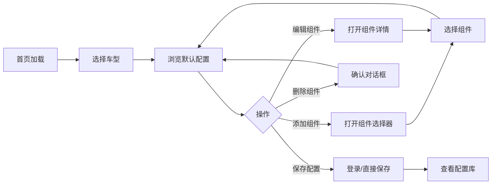

# Veloform 自行车配置器 - 原型与设计系统

> **路径**: `/prototype/prototype-guide.md`  
> **版本**: v3.1.0  
> **更新日期**: 2026-06-09

## 概述

本文档描述 Veloform 自行车配置器的设计系统以及原型与实际 Next.js 项目的映射关系。我们提供了两种原型形式：

1. **HTML 原型** (`/workspace/prototype/prototype.html`) - 独立的高保真原型，可在浏览器中直接打开
2. **Next.js 应用** (`/workspace/src/`) - 完整的生产级应用，包含所有功能

## HTML 原型功能

HTML 原型现在包含以下特性，与 Next.js 应用保持一致：

- ✅ 深色/浅色主题切换
- ✅ 车型选择器集成到主界面
- ✅ 组件配置与实时更新
- ✅ 配置汇总面板
- ✅ 成本分析图表
- ✅ 推荐配置展示
- ✅ 配置对比功能
- ✅ 用户引导流程
- ✅ 支持与帮助
- ✅ 响应式布局设计
- ✅ 渐变背景效果
- ✅ 玻璃态设计元素
- ✅ 平滑过渡动画
- ✅ Apple 设计风格（大图、留白、清晰层次）

### 使用 HTML 原型

HTML 原型是一个完全独立的文件，包含了所有必要的 HTML、CSS 和 JavaScript。您可以通过以下方式使用：

1. 在浏览器中直接打开 `/workspace/prototype/prototype.html` 文件
2. 所有交互功能均已实现，包括组件选择、配置保存、分享等
3. 原型数据存储在浏览器本地存储中，刷新页面后配置不会丢失

## 项目状态说明

### 原型演进

| 阶段 | 说明 | 状态 |
|------|------|------|
| HTML 原型 | 初始高保真原型，纯 HTML/CSS/JS 实现 | ✅ 当前版本 |
| Next.js 应用 | 生产级应用，完整功能实现 | ✅ 当前版本 |

### 当前项目特性

实际的 Next.js 应用现已包含所有原型功能，并新增以下特性：
- **深色/浅色主题切换**：完整的双主题支持
- **页脚组件**：含版本号显示
- **增强视觉效果**：渐变背景、玻璃态效果等
- **完整的后端集成**：Firebase 认证和数据持久化
- **国际化支持**：中英文双语切换

---

## 设计系统

### 颜色系统

#### 主色调

Veloform 采用 Apple 风格蓝色作为主色调：

```css
:root {
  /* 主色调 - Apple Blue */
  --primary: #0071e3;        /* 主色 */
  --primary-hover: #0077ed;  /* 悬停状态 */
  
  /* 强调色 - Apple Green */
  --accent: #34c759;
  
  /* 背景色 */
  --bg-primary: #ffffff;     /* 主背景 */
  --bg-secondary: #fafafa;   /* 次级背景 */
  --bg-tertiary: #f5f5f7;    /* 三级背景 */
  
  /* 文本颜色 */
  --text-primary: #1d1d1f;   /* 主文本 */
  --text-secondary: #86868b; /* 次要文本 */
  --text-muted: #6e6e73;     /* 弱化文本 */
  
  /* 边框 */
  --border-subtle: #d2d2d7;
  --border-light: rgba(0, 0, 0, 0.06);
  
  /* 阴影 */
  --shadow-soft: 0 4px 20px rgba(0, 0, 0, 0.08);
  --shadow-card: 0 10px 40px rgba(0, 0, 0, 0.12);
}
```

#### 深色主题

```css
[data-theme="dark"] {
  --bg-primary: #000000;
  --bg-secondary: #1d1d1f;
  --bg-tertiary: #272729;
  --color-primary: #2997ff;
  --color-primary-hover: #409cff;
  --color-accent: #30d158;
  --text-primary: #ffffff;
  --text-secondary: #86868b;
  --text-muted: #6e6e73;
  --border-subtle: #3a3a3c;
  --border-light: rgba(255, 255, 255, 0.06);
  --shadow-soft: 0 4px 20px rgba(0, 0, 0, 0.3);
  --shadow-card: 0 10px 40px rgba(0, 0, 0, 0.4);
}
```

#### 颜色使用规范

| 用途 | 颜色变量 | 示例 |
|------|----------|------|
| 主要按钮 | `--color-primary` | 保存、确认操作 |
| 次要按钮 | `--bg-secondary` + border | 取消、返回操作 |
| 强调元素 | `--color-accent` | 价格高亮、重要提示 |
| 悬停状态 | `--bg-tertiary` | 卡片悬停效果 |

### 字体系统

#### 字体家族

```css
/* 标题字体 - SF Pro Display */
h1, h2, h3, h4, h5, h6, .font-display {
  font-family: 'SF Pro Display', sans-serif;
}

/* 正文字体 - SF Pro Text */
body, p, span, div {
  font-family: 'SF Pro Text', system-ui, sans-serif;
}
```

#### 字体权重

| 权重 | 值 | 用途 |
|------|-----|------|
| Light | 300 | 次要文本、说明文字 |
| Regular | 400 | 正文内容 |
| Medium | 500 | 按钮文本、标签 |
| SemiBold | 600 | 小标题、强调文本 |
| Bold | 700 | 主标题、重要数据 |

#### 字号层级

```css
/* 基于 clamp 实现响应式 */
.hero h1 { font-size: clamp(40px, 8vw, 56px); }
.section-title { font-size: clamp(28px, 5vw, 40px); }
```

### 间距系统

基于 8px 网格系统：

```css
/* 间距层级 */
.space-1 { 0.25rem; }  /* 4px */
.space-2 { 0.5rem; }   /* 8px */
.space-3 { 0.75rem; }  /* 12px */
.space-4 { 1rem; }     /* 16px */
.space-5 { 1.25rem; }  /* 20px */
.space-6 { 1.5rem; }   /* 24px */
.space-8 { 2rem; }     /* 32px */
.space-10 { 2.5rem; }  /* 40px */
.space-12 { 3rem; }    /* 48px */
.space-16 { 4rem; }    /* 64px */
```

### 圆角系统

```css
.rounded-sm  { border-radius: 0.375rem; }  /* 6px - 小组件 */
.rounded-md  { border-radius: 0.5rem; }    /* 8px - 默认 */
.rounded-lg  { border-radius: 0.75rem; }   /* 12px - 卡片 */
.rounded-xl  { border-radius: 1rem; }      /* 16px - 大卡片 */
.rounded-2xl { border-radius: 1.5rem; }    /* 24px - 模态框 */
.rounded-3xl { border-radius: 1.75rem; }   /* 28px - Hero 卡片 */
.rounded-full { border-radius: 9999px; }   /* 完全圆角 - 按钮 */
```

### 阴影系统

```css
.shadow-soft {
  box-shadow: 0 4px 20px rgba(0, 0, 0, 0.08);
}
.shadow-card {
  box-shadow: 0 10px 40px rgba(0, 0, 0, 0.12);
}
```

### 动画系统

#### 过渡效果

```css
/* 标准过渡 - Apple 风格缓动 */
.bike-card {
  transition: all 0.35s cubic-bezier(0.4, 0, 0.2, 1);
}

/* 按钮过渡 */
.btn {
  transition: all 0.25s ease;
}
```

#### 关键帧动画

```css
/* 脉冲动画 */
@keyframes pulse {
  0%, 100% { opacity: 1; }
  50% { opacity: 0.5; }
}

/* 悬停上移 */
.bike-card:hover {
  transform: translateY(-8px);
}
```

---

## UI 组件库

### 按钮 (Button)

#### 变体

| 变体 | 样式 | 用途 |
|------|------|------|
| Primary | 主色背景 + 白色文字 | 主要操作（保存、确认） |
| Secondary | 透明背景 + 主色文字 | 次要操作（了解更多） |

#### 样式特征

```css
.btn {
  padding: 14px 28px;
  border-radius: 9999px;
  font-weight: 500;
  font-size: 17px;
  letter-spacing: -0.01em;
}

.btn-primary {
  background: var(--color-primary);
  color: white;
  box-shadow: 0 4px 14px rgba(0, 113, 227, 0.25);
}

.btn-primary:hover {
  background: var(--color-primary-hover);
  transform: translateY(-2px);
  box-shadow: 0 6px 20px rgba(0, 113, 227, 0.35);
}
```

### 卡片 (Card)

```html
<div class="card">
  <div class="card-header">
    <h3>卡片标题</h3>
  </div>
  <div class="card-body">
    <p>卡片内容</p>
  </div>
</div>
```

**样式特征**：
- 背景：`var(--bg-secondary)`
- 边框：`1px solid var(--border-light)`
- 圆角：`24px`
- 内边距：`28px`
- 悬停效果：轻微上移 + 阴影加深

### 车型选择器 (Bike Type Selector)

```html
<div class="bike-grid">
  <div class="bike-card active">
    <div class="bike-icon">🚴</div>
    <div class="bike-name">公路车</div>
    <div class="bike-desc">速度与激情...</div>
    <div class="bike-active-dot"></div>
  </div>
</div>
```

**样式特征**：
- 网格布局：`grid-template-columns: repeat(3, 1fr)`
- 圆角：`24px`
- 悬停效果：上移 8px + 阴影
- 激活状态：主色边框 + 渐变背景
- 图标动画：激活时缩放 1.1 + 旋转 5deg

---

## 原型与实际项目映射

### 组件对应关系

| 原型组件 | 实际项目组件 | 路径 | 状态 |
|----------|-------------|------|------|
| 车型选择器 | `BikeTypeSelector` | `src/components/configurator/BikeTypeSelector.tsx` | 已实现 |
| 组件清单 | `BuildList` | `src/components/configurator/BuildList.tsx` | 已实现 |
| 组件选择器 | `ComponentSelector` | `src/components/configurator/ComponentSelector.tsx` | 已实现 |
| 组件详情 | `ComponentDetailModal` | `src/components/configurator/ComponentDetailModal.tsx` | 已实现 |
| 汇总面板 | `SummaryPanel` | `src/components/configurator/SummaryPanel.tsx` | 已实现 |
| 成本图表 | `CostBreakdownChart` | `src/components/configurator/CostBreakdownChart.tsx` | 已实现 |
| 推荐配置 | `RecommendedConfigs` | `src/components/configurator/RecommendedConfigs.tsx` | 已实现 |
| 配置比较 | `ComparePanel` | `src/components/configurator/ComparePanel.tsx` | 已实现 |
| 分享模态框 | `ShareModal` | `src/components/configurator/ShareModal.tsx` | 已实现 |
| 导航栏 | `Navbar` | `src/components/layout/Navbar.tsx` | 已实现 |
| 页脚 | `Footer` | `src/components/layout/Footer.tsx` | 新增 |
| 主题切换 | `ThemeToggle` | `src/components/ui/ThemeToggle.tsx` | 已实现 |

### 功能对比

| 功能 | 原型 | 实际项目 | 差异说明 |
|------|------|----------|----------|
| 车型切换 | 静态切换 | Zustand 状态管理 | 实际项目支持持久化 |
| 组件配置 | 硬编码数据 | Firebase Firestore | 实际项目支持云端同步 |
| 用户认证 | 无 | Firebase Auth | 实际项目支持登录/注册 |
| 配置保存 | 本地存储 | Firestore + localStorage | 实际项目支持多设备同步 |
| 国际化 | 中文 | EN/ZH-CN 双语 | 实际项目支持语言切换 |
| 主题切换 | 深色/浅色 | 深色/浅色切换 | 完全一致 |
| 响应式 | 基础适配 | 完整响应式 | 实际项目优化移动端体验 |

### 技术栈对比

| 层面 | 原型 | 实际项目 |
|------|------|----------|
| 框架 | 无（纯 HTML） | Next.js 14 |
| 语言 | JavaScript | TypeScript |
| 样式 | 内联 CSS | Tailwind CSS |
| 状态管理 | 原生 JS 变量 | Zustand |
| 后端 | 无 | Firebase (Auth + Firestore) |
| 动画 | CSS transitions | Framer Motion |
| 国际化 | 无 | 自定义 i18n 系统 |
| 部署 | 静态文件 | Vercel / EdgeOne Pages |

---

## 响应式设计

### 断点

```css
/* Mobile First */
@media (min-width: 640px) { /* sm */ }
@media (min-width: 768px) { /* md - Tablet */ }
@media (min-width: 1024px) { /* lg - Desktop */ }
@media (min-width: 1280px) { /* xl - Large Desktop */ }
```

### 布局适配

| 断点 | 布局策略 |
|------|----------|
| Mobile (<768px) | 单列布局，堆叠排列 |
| Tablet (768-1023px) | 双列布局，侧边栏折叠 |
| Desktop (1024px+) | 三列布局，完整功能展示 |

---

## 交互流程

### 核心用户旅程



### 关键交互点

1. **车型切换**：平滑过渡动画，重置配置为默认值
2. **组件选择**：按类别筛选，实时预览
3. **价格计算**：实时更新，成本分布可视化
4. **重量追踪**：克/千克单位转换
5. **配置保存**：Toast 反馈，自动同步云端
6. **配置加载**：从配置库选择，一键应用

---

## 设计原则

### 1. 极简主义

- 去除不必要的装饰元素
- 聚焦核心功能展示
- 留白充足，视觉呼吸感

### 2. 大图展示

- Hero 区域使用大尺寸视觉元素
- 产品图片占据主要视觉空间
- 图标和图形元素清晰可见

### 3. 微交互

- 悬停反馈
- 点击涟漪效果
- 状态过渡动画

### 4. 一致性

- 统一的圆角规范
- 一致的间距系统
- 标准化的颜色语义

### 5. 可访问性

- 足够的色彩对比度
- 键盘导航支持
- ARIA 属性标注

---

## 后续改进方向

### 已完成（v3.1.x）

- ✅ 深色/浅色主题切换
- ✅ 页脚组件（含版本号显示）
- ✅ 视觉效果优化（玻璃态、渐变背景）
- ✅ Apple 设计风格（大图、留白、层次）

### 短期（v3.2.x）

- [ ] 完善移动端触摸交互优化
- [ ] 添加配置导入/导出功能
- [ ] 优化成本图表交互体验
- [ ] 增加配置分享链接生成

### 中期（v3.3.x）

- [ ] 集成 3D 模型预览（Three.js）
- [ ] 添加 AR 预览功能（WebXR）
- [ ] 实现配置版本对比
- [ ] 支持更多自行车品类（Gravel、BMX）

### 长期（v4.x）

- [ ] AI 推荐配置引擎
- [ ] 社区配置市场
- [ ] 实体店库存对接
- [ ] 多语言扩展（JA、KO、DE、FR）

---

## 版本历史

| 版本 | 日期 | 变更内容 |
|------|------|---------|
| **v3.1.0** | 2026-06-09 | 参考 Apple 设计风格优化原型：增加大图展示、充足留白、清晰视觉层次、渐变背景效果、主题切换功能 |
| v3.0.0 | 2026-06-08 | 全面 Apple 风格设计升级 |
| v2.3.1 | 2026-06-06 | 文档迁移至 prototype 目录，更新路径引用 |
| v2.3.0 | 2026-06-04 | 更新文档版本号至 3.6.0，与项目版本统一 |
| v2.2.0 | 2026-06-04 | 文档移至 openspec 目录，更新所有引用路径 |
| v2.1.0 | 2026-06-04 | 更新文档反映原型文件已删除的情况，新增页脚组件、视觉效果说明，完善版本历史 |
| v2.0.0 | 2026-06-01 | 建立原型与实际项目映射关系，更新设计系统文档 |

---

## 相关文档

- [prototype/README.md](./README.md) - 原型设计总览
- [openspec/README.md](../openspec/README.md) - 规范文档索引
- [openspec/SPEC.md](../openspec/SPEC.md) - 项目规范概览
- [openspec/design/ui-design-system.md](../openspec/design/ui-design-system.md) - UI 设计系统规范
- [openspec/design/design-review.md](../openspec/design/design-review.md) - 设计审查与优化建议

---

**文档路径**: `/prototype/prototype-guide.md`  
**最后更新**: 2026-06-09  
**版本**: v3.1.0
